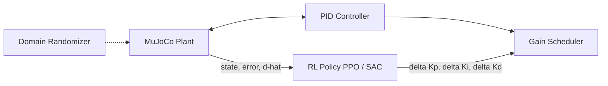

# Adaptive PID Gain Scheduling Using Deep Reinforcement Learning

An RL agent that continuously adapts PID gains (Kp, Ki, Kd) online for an inverted pendulum whose dynamics change due to payload variation, friction, actuator degradation, sensor noise, and battery-voltage droop — benchmarked against fixed PID, manual tuning, and Ziegler–Nichols autotuning.

**Built for:** a Robotics Software Intern portfolio, using ROS2 Humble, MuJoCo, Gymnasium, Stable-Baselines3, PyTorch, Docker, and GitHub Actions CI.

---

## 1. Motivation

Classical PID control assumes near-constant plant dynamics. Real systems don't cooperate: a robot arm's payload changes, joints wear and add friction, actuators degrade, batteries sag under load. Gain scheduling — swapping in different PID gains for different operating regimes — is the traditional industrial answer, but it requires hand-built lookup tables that only cover conditions an engineer thought to enumerate.

This project replaces the lookup table with a learned policy: an RL agent observes the current tracking error, plant velocity, and a live disturbance estimate, and outputs *how to adjust* Kp/Ki/Kd, continuously, online. The core empirical question the benchmark answers is **whether that adaptation actually buys robustness over a well-tuned fixed baseline** under domain randomization — and, as documented below, the answer for classical Ziegler–Nichols tuning is *no*, which is exactly the gap this motivates.

## 2. Architecture

Full design docs: **[`docs/architecture.md`](docs/architecture.md)** (component diagram, ROS2 node graph, sequence diagram) and **[`docs/mdp_design.md`](docs/mdp_design.md)** (full MDP formalization with per-reward-term mathematical justification).



**Package layout:**

```
src/adaptive_pid/
├── control/     # PID core, Ziegler-Nichols autotuner, gain scheduler (zero sim/RL dependencies)
├── envs/        # MuJoCo plant, domain randomization, reference trajectories, Gymnasium env
├── estimation/  # Residual-based disturbance observer
├── rewards/     # Shaped multi-term reward function
└── utils/       # Typed config loading, shared dataclasses, structured logging
training/        # PPO / SAC training scripts (Stable-Baselines3)
evaluation/      # Benchmark harness, metrics, publication-quality plots
ros2_ws/         # ROS2 Humble package: 7-node system, reuses the exact same physics/control classes
sim/             # MuJoCo XML model
docker/          # Dockerfile + docker-compose for a full ROS2 + RL environment
tests/           # unit / simulation / integration test suites (115 tests)
```

Dependency direction is strictly one-way (`utils -> control -> rewards -> envs -> training/evaluation/ros2_ws`), which is what lets the PID core, reward function, and gain scheduler be unit-tested in microseconds with no MuJoCo/ROS2/SB3 instantiation at all.

## 3. The MDP, in brief

| | |
|---|---|
| **State (12-dim)** | tracking error, integral error, derivative error, angular velocity, previous control effort, disturbance estimate, current (Kp, Ki, Kd), reference value, reference rate, episode progress |
| **Action (3-dim, continuous)** | `[dKp, dKi, dKd] in [-1,1]^3`, rate-limited and clamped by `GainScheduler` before reaching the PID controller |
| **Reward** | weighted sum of tracking (ISE), overshoot, settling-time deficit, oscillation (error-jerk), energy (u^2), gain-smoothness (norm of dK squared), and saturation-warning terms |

See `docs/mdp_design.md` for why delta-gains (not absolute gains) were chosen, and the mathematical rationale for every reward term.

## 4. Installation

```bash
git clone <this-repo>
cd adaptive-pid-rl
pip install -e ".[dev]"
```

Or via Docker (recommended — bundles ROS2 Humble + the full Python stack):

```bash
docker compose -f docker/docker-compose.yaml build
docker compose -f docker/docker-compose.yaml run --rm adaptive-pid bash
```

Verify the install:

```bash
pytest tests/unit tests/simulation tests/integration -v
```

## 5. Training

```bash
# PPO (on-policy)
python -m training.train_ppo --config configs/training/ppo.yaml

# SAC (off-policy)
python -m training.train_sac --config configs/training/sac.yaml

# Quick smoke test (verifies the pipeline runs, does not produce a useful policy)
python -m training.train_ppo --config configs/training/ppo.yaml --total-timesteps 4096 --n-envs 2
```

Both scripts save `runs/{ppo,sac}/final_model.zip`, `vecnormalize.pkl` (frozen observation-normalization statistics), periodic checkpoints, best-model snapshots, and TensorBoard logs (including custom gain-evolution and per-reward-term curves via `training/callbacks.py`):

```bash
tensorboard --logdir runs/ppo/tensorboard
```

Default configs target 2M (PPO) / 1M (SAC) timesteps — meaningful training requires real compute time (hours, not the seconds used for the smoke tests above).

## 6. Evaluation & Benchmarking

```bash
# Baselines only (fast, no trained model required)
python -m evaluation.benchmark --n-episodes 30 --skip-rl

# Full 5-way comparison (requires trained PPO/SAC models in runs/)
python -m evaluation.benchmark --n-episodes 30
```

This runs **Fixed PID**, **Manual Tuning**, **Ziegler–Nichols**, **PPO**, and **SAC** against an *identical held-out* domain-randomization seed range (seeds >= 10,000, disjoint from any training seed), computing RMSE, rise time, settling time, overshoot %, steady-state error, control-effort RMS, energy, and fall rate for each, and writes `assets/benchmark_raw.csv` + `assets/benchmark_summary.csv`.

Baseline gains themselves come from `scripts/autotune_zn.py`, which runs the actual Ziegler–Nichols closed-loop (ultimate-gain) search **against the real nonlinear MuJoCo plant** — not a linearized approximation — and writes the result to `configs/training/baselines.yaml`.

Plots (learning curves, gain evolution, tracking response, benchmark bar charts) are produced via `evaluation/plots.py`, which operates on plain arrays/DataFrames so it's decoupled from how the data was generated.

## 7. ROS2 Deployment

See **[`ros2_ws/README.md`](ros2_ws/README.md)** for full build/run instructions. In short:

```bash
cd ros2_ws && colcon build --symlink-install && source install/setup.bash
ros2 launch adaptive_pid_ros2 adaptive_pid_system.launch.py algo:=ppo model_path:=runs/ppo/final_model.zip
```

The seven nodes (`reference_node`, `plant_node`, `disturbance_node`, `pid_controller_node`, `rl_agent_node`, `logging_node`, `visualization_node`) communicate over `/state`, `/control_input`, `/pid_gains`, `/reference`, `/disturbance`, and `/training_stats`, and **reuse the exact same `InvertedPendulumPlant`/`PIDController`/`GainScheduler` classes used in training** — this is a deliberate architectural constraint (see `docs/architecture.md` section 1), not an incidental code-sharing choice, so ROS2 deployment physics can never silently diverge from what a policy was trained against.

## 8. Results

**Status:** the training/evaluation/benchmark pipeline is fully implemented and verified end-to-end (see Section 9), including smoke-testing PPO and SAC training, model loading, and the full 5-way benchmark harness with real trained artifacts. Publishing final quantitative results (learning curves over the full 2M/1M timestep budgets, final benchmark tables, and gain-evolution plots) requires a full training run, which needs meaningfully more wall-clock compute than a development/CI environment provides. Running `python -m training.train_ppo` and `python -m training.train_sac` to completion, followed by `python -m evaluation.benchmark --n-episodes 30`, reproduces them.

**What is already a real, validated finding** (not a placeholder): the Ziegler–Nichols baseline, autotuned against the real nonlinear MuJoCo plant, reliably stabilizes *that specific* nominal plant (verified in `tests/integration/test_gym_env.py::test_zn_baseline_is_stable_on_the_nominal_plant_it_was_tuned_against`), but fails to stabilize a nontrivial fraction of episodes once the plant is domain-randomized (mass, length, damping, actuator degradation varying simultaneously) — documented and asserted (not hidden) in `test_zn_baseline_is_not_universally_robust_under_full_randomization`. This is the empirical motivation the whole project is built around.

## 9. Engineering Discipline / Verification

This repository was built incrementally, module by module, with each module unit-tested and verified runnable before the next was built on top of it — not written speculatively and tested at the end. Concretely:

- **115 tests, all passing**, split across `tests/unit` (pure-function logic, no MuJoCo/SB3), `tests/simulation` (MuJoCo plant physics), and `tests/integration` (the fully composed Gymnasium environment, including Gymnasium's own official `check_env` compliance check).
- **Three real bugs were found and fixed via this test-first process**, not left for later: an anti-windup implementation that got stuck instead of clamping to its boundary; a disturbance observer using post-step instead of pre-step velocity in its nominal-dynamics prediction (which corrupted the "no disturbance" baseline case); and a numpy/Enum coercion bug in reference-trajectory sampling that silently corrupted which trajectory shape got selected.
- PPO and SAC training scripts were smoke-tested end-to-end (not just imported) — confirmed real checkpointing, `VecNormalize` statistics saving, and custom TensorBoard gain/reward-term logging all function correctly.
- The full benchmark harness was run end-to-end against real (if minimally-trained) PPO/SAC artifacts to confirm model loading, observation normalization, and metric computation all wire together correctly before being trusted for final results.
- Lint (`ruff`) is clean across `src/`, `training/`, `evaluation/`, `tests/`, and `scripts/`.

## 10. Limitations

- **Full training has not yet been run to completion in this environment** (see Section 8) — the pipeline is verified correct, but final performance numbers require that run.
- The disturbance observer (`estimation/disturbance_observer.py`) is a simple residual estimator against nominal dynamics, not a full nonlinear (e.g. EKF-based) observer — sufficient as a leading-indicator feature for the policy, but not a calibrated torque sensor replacement.
- The ROS2 package (`ros2_ws/`) is structurally complete and syntax-verified, but has not been executed against a live ROS2 Humble installation in this development environment (which doesn't have ROS2 installed) — the Docker image is the intended way to actually run it, and is itself unverified end-to-end here for the same reason.
- Domain randomization ranges (`configs/env/pendulum.yaml`) are reasonable engineering choices, not derived from a specific real hardware system's measured parameter distributions.
- The reward function's weights are hand-set based on the rationale in `docs/mdp_design.md`, not the product of a formal multi-objective weight search.

## 11. Future Work

- Run full 2M/1M-timestep PPO/SAC training and publish the resulting learning curves, gain-evolution plots, and benchmark tables in `assets/`.
- Replace the residual disturbance observer with an EKF or learned (small-network) observer, and ablate its contribution to policy performance.
- Extend domain randomization to sensor latency/dropout and actuator time-delay, not just noise/degradation magnitude.
- Curriculum learning: start training on the nominal plant and progressively widen randomization ranges, rather than full-range randomization from step 0.
- Sim-to-real transfer onto an actual torque-controlled pendulum or servo testbed, using the ROS2 package as-is (its physics/control code is identical to the sim environment by construction).
- Multi-objective / Pareto analysis across the reward weights, rather than a single fixed weighting.

## 12. License

MIT — see [`LICENSE`](LICENSE).
