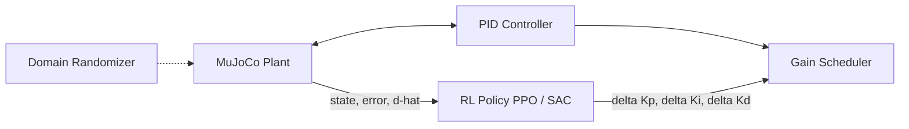

# Adaptive PID Gain Scheduling Using Deep Reinforcement Learning

[](https://github.com/Ebyjoey/adaptive-pid-rl/actions/workflows/ci.yml)
[](LICENSE)
[](pyproject.toml)
[](https://github.com/astral-sh/ruff)


An RL agent that continuously adapts PID gains (Kp, Ki, Kd) online for an inverted pendulum whose dynamics change due to payload variation, friction, actuator degradation, sensor noise, and battery-voltage droop — benchmarked against fixed PID, manual tuning, and Ziegler–Nichols autotuning.

**Built for:** a Robotics Software Intern portfolio, using ROS2 Humble, MuJoCo, Gymnasium, Stable-Baselines3, PyTorch, Docker, and GitHub Actions CI.

---

## 1. Motivation

Classical PID control assumes near-constant plant dynamics. Real systems don't cooperate: a robot arm's payload changes, joints wear and add friction, actuators degrade, batteries sag under load. Gain scheduling — swapping in different PID gains for different operating regimes — is the traditional industrial answer, but it requires hand-built lookup tables that only cover conditions an engineer thought to enumerate.

This project replaces the lookup table with a learned policy: an RL agent observes the current tracking error, plant velocity, and a live disturbance estimate, and outputs *how to adjust* Kp/Ki/Kd, continuously, online. The core empirical question the benchmark answers is **whether that adaptation actually buys robustness over a well-tuned fixed baseline** under domain randomization — and, as documented below, the answer for classical Ziegler–Nichols tuning is *no*, which is exactly the gap this motivates.

## 2. Architecture

Full design docs: **[`docs/architecture.md`](docs/architecture.md)** (component diagram, ROS2 node graph, sequence diagram) and **[`docs/mdp_design.md`](docs/mdp_design.md)** (full MDP formalization with per-reward-term mathematical justification).



**Package layout:**

```
src/adaptive_pid/
├── control/     # PID core, Ziegler-Nichols autotuner, gain scheduler (zero sim/RL dependencies)
├── envs/        # MuJoCo plant, domain randomization, reference trajectories, Gymnasium env
├── estimation/  # Residual-based disturbance observer
├── rewards/     # Shaped multi-term reward function
└── utils/       # Typed config loading, shared dataclasses, structured logging
training/        # PPO / SAC training scripts (Stable-Baselines3)
evaluation/      # Benchmark harness, metrics, publication-quality plots
ros2_ws/         # ROS2 Humble package: 7-node system, reuses the exact same physics/control classes
sim/             # MuJoCo XML model
docker/          # Dockerfile + docker-compose for a full ROS2 + RL environment
tests/           # unit / simulation / integration test suites (115 tests)
```

Dependency direction is strictly one-way (`utils -> control -> rewards -> envs -> training/evaluation/ros2_ws`), which is what lets the PID core, reward function, and gain scheduler be unit-tested in microseconds with no MuJoCo/ROS2/SB3 instantiation at all.
