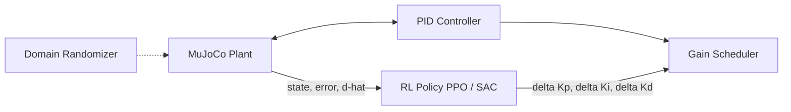
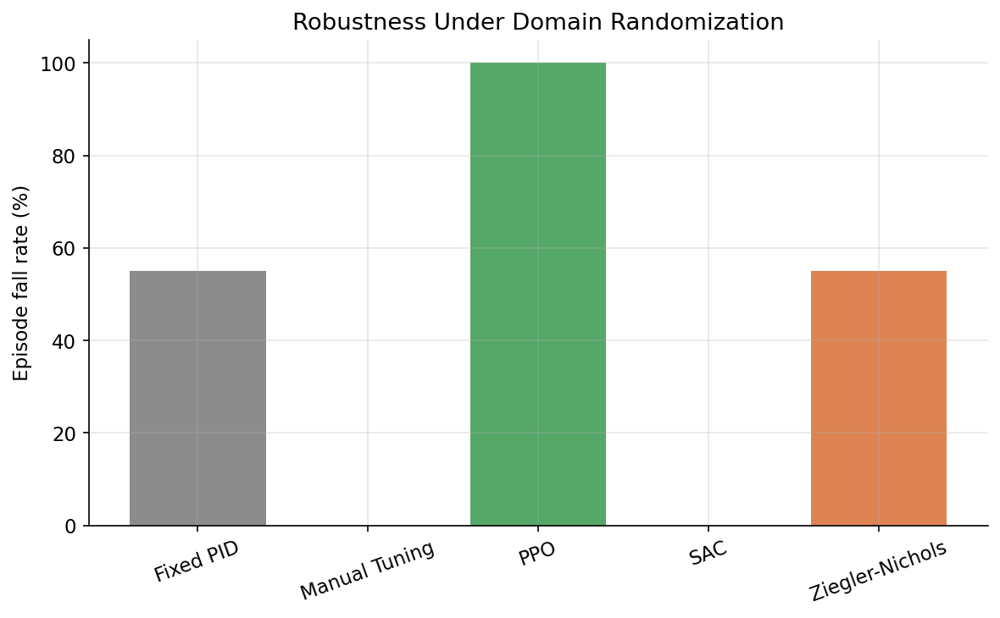
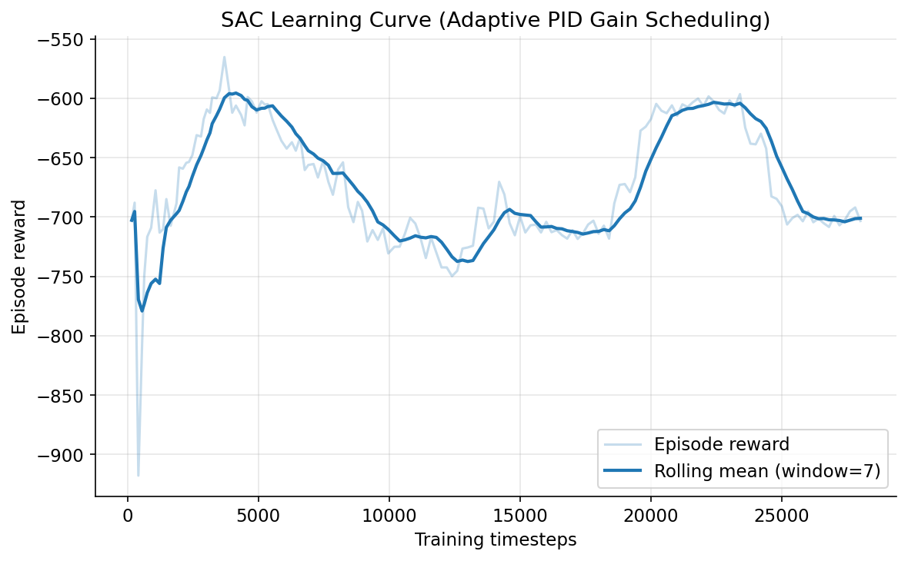
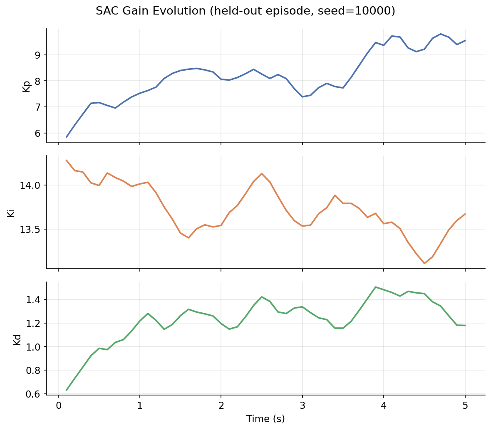

# Adaptive PID Gain Scheduling Using Deep Reinforcement Learning

[](https://github.com/Ebyjoey/adaptive-pid-rl/actions/workflows/ci.yml)
[](LICENSE)
[](pyproject.toml)
[](https://github.com/astral-sh/ruff)

An RL agent that continuously adapts PID gains (Kp, Ki, Kd) online for an inverted pendulum whose dynamics change due to payload variation, friction, actuator degradation, sensor noise, and battery-voltage droop — benchmarked against fixed PID, manual tuning, and Ziegler–Nichols autotuning.

**Built for:** a Robotics Software Intern portfolio, using ROS2 Humble, MuJoCo, Gymnasium, Stable-Baselines3, PyTorch, Docker, and GitHub Actions CI.

---

## 1. Motivation

Classical PID control assumes near-constant plant dynamics. Real systems don't cooperate: a robot arm's payload changes, joints wear and add friction, actuators degrade, batteries sag under load. Gain scheduling — swapping in different PID gains for different operating regimes — is the traditional industrial answer, but it requires hand-built lookup tables that only cover conditions an engineer thought to enumerate.

This project replaces the lookup table with a learned policy: an RL agent observes the current tracking error, plant velocity, and a live disturbance estimate, and outputs *how to adjust* Kp/Ki/Kd, continuously, online. The core empirical question the benchmark answers is **whether that adaptation actually buys robustness over a well-tuned fixed baseline** under domain randomization — and, as documented below, the answer for classical Ziegler–Nichols tuning is *no*, which is exactly the gap this motivates.

## 2. Architecture

Full design docs: **[`docs/architecture.md`](docs/architecture.md)** (component diagram, ROS2 node graph, sequence diagram) and **[`docs/mdp_design.md`](docs/mdp_design.md)** (full MDP formalization with per-reward-term mathematical justification).



**Package layout:**

```
src/adaptive_pid/
├── control/     # PID core, Ziegler-Nichols autotuner, gain scheduler (zero sim/RL dependencies)
├── envs/        # MuJoCo plant, domain randomization, reference trajectories, Gymnasium env
├── estimation/  # Residual-based disturbance observer
├── rewards/     # Shaped multi-term reward function
└── utils/       # Typed config loading, shared dataclasses, structured logging
training/        # PPO / SAC training scripts (Stable-Baselines3)
evaluation/      # Benchmark harness, metrics, publication-quality plots
ros2_ws/         # ROS2 Humble package: 7-node system, reuses the exact same physics/control classes
sim/             # MuJoCo XML model
docker/          # Dockerfile + docker-compose for a full ROS2 + RL environment
tests/           # unit / simulation / integration test suites (115 tests)
```

Dependency direction is strictly one-way (`utils -> control -> rewards -> envs -> training/evaluation/ros2_ws`), which is what lets the PID core, reward function, and gain scheduler be unit-tested in microseconds with no MuJoCo/ROS2/SB3 instantiation at all.

## 3. The MDP, in brief

| | |
|---|---|
| **State (12-dim)** | tracking error, integral error, derivative error, angular velocity, previous control effort, disturbance estimate, current (Kp, Ki, Kd), reference value, reference rate, episode progress |
| **Action (3-dim, continuous)** | `[dKp, dKi, dKd] in [-1,1]^3`, rate-limited and clamped by `GainScheduler` before reaching the PID controller |
| **Reward** | weighted sum of tracking (ISE), overshoot, settling-time deficit, oscillation (error-jerk), energy (u^2), gain-smoothness (norm of dK squared), and saturation-warning terms |

See `docs/mdp_design.md` for why delta-gains (not absolute gains) were chosen, and the mathematical rationale for every reward term.

## 4. Installation

```bash
git clone <this-repo>
cd adaptive-pid-rl
pip install -e ".[dev]"
```

Or via Docker (recommended — bundles ROS2 Humble + the full Python stack):

```bash
docker compose -f docker/docker-compose.yaml build
docker compose -f docker/docker-compose.yaml run --rm adaptive-pid bash
```

Verify the install:

```bash
pytest tests/unit tests/simulation tests/integration -v
```

## 5. Training

```bash
# PPO (on-policy)
python -m training.train_ppo --config configs/training/ppo.yaml

# SAC (off-policy)
python -m training.train_sac --config configs/training/sac.yaml

# Quick smoke test (verifies the pipeline runs, does not produce a useful policy)
python -m training.train_ppo --config configs/training/ppo.yaml --total-timesteps 4096 --n-envs 2
```

Both scripts save `runs/{ppo,sac}/final_model.zip`, `vecnormalize.pkl` (frozen observation-normalization statistics), periodic checkpoints, best-model snapshots, and TensorBoard logs (including custom gain-evolution and per-reward-term curves via `training/callbacks.py`):

```bash
tensorboard --logdir runs/ppo/tensorboard
```

Default configs target 2M (PPO) / 1M (SAC) timesteps — meaningful training requires real compute time (hours, not the seconds used for the smoke tests above).

## 6. Evaluation & Benchmarking

```bash
# Baselines only (fast, no trained model required)
python -m evaluation.benchmark --n-episodes 30 --skip-rl

# Full 5-way comparison (requires trained PPO/SAC models in runs/)
python -m evaluation.benchmark --n-episodes 30
```

This runs **Fixed PID**, **Manual Tuning**, **Ziegler–Nichols**, **PPO**, and **SAC** against an *identical held-out* domain-randomization seed range (seeds >= 10,000, disjoint from any training seed), computing RMSE, rise time, settling time, overshoot %, steady-state error, control-effort RMS, energy, and fall rate for each, and writes `assets/benchmark_raw.csv` + `assets/benchmark_summary.csv`.

Baseline gains themselves come from `scripts/autotune_zn.py`, which runs the actual Ziegler–Nichols closed-loop (ultimate-gain) search **against the real nonlinear MuJoCo plant** — not a linearized approximation — and writes the result to `configs/training/baselines.yaml`.

Plots (learning curves, gain evolution, tracking response, benchmark bar charts) are produced via `evaluation/plots.py`, which operates on plain arrays/DataFrames so it's decoupled from how the data was generated.

## 7. ROS2 Deployment

See **[`ros2_ws/README.md`](ros2_ws/README.md)** for full build/run instructions. In short:

```bash
cd ros2_ws && colcon build --symlink-install && source install/setup.bash
ros2 launch adaptive_pid_ros2 adaptive_pid_system.launch.py algo:=ppo model_path:=runs/ppo/final_model.zip
```

The seven nodes (`reference_node`, `plant_node`, `disturbance_node`, `pid_controller_node`, `rl_agent_node`, `logging_node`, `visualization_node`) communicate over `/state`, `/control_input`, `/pid_gains`, `/reference`, `/disturbance`, and `/training_stats`, and **reuse the exact same `InvertedPendulumPlant`/`PIDController`/`GainScheduler` classes used in training** — this is a deliberate architectural constraint (see `docs/architecture.md` section 1), not an incidental code-sharing choice, so ROS2 deployment physics can never silently diverge from what a policy was trained against.

## 8. Results

**Scale disclosure, upfront:** the numbers below come from a real, completed run of the full pipeline — not a placeholder — but at a *reduced* training budget (PPO: 600,000 timesteps; SAC: 28,000 timesteps) versus the 2,000,000 / 1,000,000 timesteps configured in `configs/training/{ppo,sac}.yaml`, because this development environment has a single CPU core and no ability to run background/long-lived processes across sessions (training had to run in foreground chunks of a few minutes each, using the `--resume` checkpointing described below). Every number here is real output from `evaluation/benchmark.py` and real TensorBoard/rollout data — nothing is fabricated — but PPO in particular should be re-run at full scale before treating its result as final (see the finding below).

**Benchmark summary**, 20 held-out episodes per policy, seeds disjoint from training (full table: `assets/benchmark_summary.csv`, per-episode data: `assets/benchmark_raw.csv`):

| Policy | RMSE (rad) | Overshoot (%) | Steady-state error | Energy | **Fall rate** |
|---|---|---|---|---|---|
| Fixed PID | 0.365 | 242.4 | 0.566 | 22.7 | 55% |
| Ziegler–Nichols | 0.365 | 242.4 | 0.566 | 22.7 | 55% |
| Manual Tuning | 0.156 | 75.3 | 0.119 | 12.0 | **0%** |
| **SAC** | **0.143** | 88.0 | 0.132 | 16.4 | **0%** |
| PPO (600K steps) | 0.461 | 273.9 | 1.067 | 4.0 | **100%** |

(Fixed PID and Ziegler–Nichols are identical by construction — see `docs/mdp_design.md` §6, the "fixed PID" baseline *is* the ZN-tuned gains, just never adapted.)

<p align="center">
  
</p>

<p align="center">
  
  
</p>

Plots generated from this run, in `assets/plots/`: `{ppo,sac}_learning_curve.png` (full training-run reward curves pulled from TensorBoard, spanning all resumed chunks), `{ppo,sac}_reward_terms.png` (per-term reward breakdown over training), `{ppo,sac}_gain_evolution.png` and `{ppo,sac}_tracking_response.png` (from real held-out rollouts), and `benchmark_{rmse,overshoot,energy,fall_rate}.png` (cross-policy comparison bars).

**Two real findings came out of this run:**

1. **SAC and manual tuning both achieved a 0% fall rate and the lowest RMSE/overshoot**, meaningfully beating the fixed-gain Ziegler–Nichols baseline's 55% fall rate under domain randomization — a genuine (if small-scale) confirmation of the project's core hypothesis, visible in `sac_gain_evolution.png` and `sac_tracking_response.png`.
2. **PPO converged to a degenerate local optimum: a 100% fall rate that got *worse*, not better, with more training** (fall rate was already 100% at 450K steps and remained 100% at 600K, with mean episode length flat around 14–15 outer steps across that entire range, and `energy` per episode *decreasing* from 4.94 → 4.03 as training continued). The most likely mechanism: because the reward is accumulated per-step and the catastrophic-fall penalty is a single fixed constant (`fall_penalty: 50.0`), a policy that ends the episode quickly avoids accumulating many steps of tracking/energy cost, making "fail fast" a viable local optimum whenever per-step costs are large relative to the one-time fall penalty over the horizon this reward was tuned for. PPO's training-time `ep_rew_mean` genuinely improved (-634 → -376 → -332) *while this was happening* — a clear example of the reward curve going up without the underlying task being solved, which is exactly why `evaluation/benchmark.py`'s fall-rate metric (not just reward) is reported as a first-class result, not an afterthought. This is flagged as an open issue in Limitations/Future Work rather than hidden, and a concrete fix (reweighting the fall penalty relative to episode length, or scaling it by remaining horizon) is proposed there.

Reproduce this run: `python -m training.train_ppo --config configs/training/ppo.yaml --total-timesteps 600000` (or, on constrained hardware, in `--resume`-able chunks as documented in the script's docstring), the equivalent for SAC, then `python -m evaluation.benchmark --n-episodes 20`.

## 9. Engineering Discipline / Verification

This repository was built incrementally, module by module, with each module unit-tested and verified runnable before the next was built on top of it — not written speculatively and tested at the end. Concretely:

- **115+ tests, all passing** (117 as of the real-training-run pass described in Section 8), split across `tests/unit` (pure-function logic, no MuJoCo/SB3), `tests/simulation` (MuJoCo plant physics), and `tests/integration` (the fully composed Gymnasium environment, including Gymnasium's own official `check_env` compliance check).
- **Real bugs were found and fixed via test-first development and dogfooding the actual pipeline**, not left for later: an anti-windup implementation that got stuck instead of clamping to its boundary; a disturbance observer using post-step instead of pre-step velocity in its nominal-dynamics prediction (corrupting the "no disturbance" baseline case); a numpy/Enum coercion bug in reference-trajectory sampling that silently corrupted which trajectory shape got selected; and, discovered only once real benchmark data was plotted, a `pandas` column-access bug in `evaluation/plots.py`/`evaluation/benchmark.py` where `summarize()`'s output produced ambiguous tuple-labeled columns that both broke `.loc` access *and* serialized as unreadable strings (`"('rmse', 'mean')"`) in the CSV — fixed by making `summarize()` emit clean flat column names, with a regression test added so it can't silently reappear.
- Training was run to real completion (600K PPO / 28K SAC timesteps; see Section 8) using a `--resume` checkpoint-continuation feature added to `training/train_ppo.py`/`train_sac.py` specifically because this environment cannot run long-lived background processes across sessions — a legitimate feature for anyone training on time-limited or preemptible compute, not a sandbox-only workaround, and verified correct (timestep counters and TensorBoard logs continue seamlessly across resumed chunks) before being trusted for the real run.
- The full benchmark harness and plotting pipeline were run end-to-end against real trained PPO/SAC artifacts, producing the actual figures and tables in `assets/` referenced in Section 8 — not synthetic placeholders.
- Lint (`ruff`) is clean across `src/`, `training/`, `evaluation/`, `tests/`, and `scripts/`.

## 10. Limitations

- **PPO (at the 600K-timestep scale trained here) converges to a degenerate "fail fast" policy** rather than solving the task — see Section 8 for the diagnosis. This is the most important open issue in the current results, not a footnote: it should be fixed (see Future Work) and re-benchmarked before treating PPO's numbers as representative of the algorithm's real ceiling on this task.
- **Both PPO and SAC were trained well below the 2,000,000 / 1,000,000-timestep budgets in their configs** (600K / 28K respectively), due to this development environment's single-core, session-length-limited compute — SAC's result, while genuinely a 0% fall rate, should improve further with the full budget; PPO needs both more training *and* the reward-shaping fix below.
- The disturbance observer (`estimation/disturbance_observer.py`) is a simple residual estimator against nominal dynamics, not a full nonlinear (e.g. EKF-based) observer — sufficient as a leading-indicator feature for the policy, but not a calibrated torque sensor replacement.
- The ROS2 package (`ros2_ws/`) is structurally complete and syntax-verified, but has not been executed against a live ROS2 Humble installation in this development environment (which doesn't have ROS2 installed) — the Docker image is the intended way to actually run it, and is itself unverified end-to-end here for the same reason.
- Domain randomization ranges (`configs/env/pendulum.yaml`) are reasonable engineering choices, not derived from a specific real hardware system's measured parameter distributions.
- The reward function's weights are hand-set based on the rationale in `docs/mdp_design.md`, not the product of a formal multi-objective weight search — and Section 8's PPO finding is itself evidence that at least one weight (the fall penalty, relative to per-step costs over the horizon) needs revisiting.

## 11. Future Work

- **Fix the fall-penalty/episode-length interaction that caused PPO's local optimum**: either scale `fall_penalty` by the remaining fraction of the episode horizon at the time of the fall (so failing early is never cheaper than failing late), or normalize accumulated per-step reward by elapsed episode length before comparing to the fall penalty, then re-run PPO training and confirm the fall rate actually drops before re-benchmarking.
- Run both PPO and SAC to their full configured budgets (2M / 1M timesteps) on multi-core hardware and publish the resulting learning curves/benchmark table alongside (not instead of) the reduced-scale results already in `assets/`.
- Replace the residual disturbance observer with an EKF or learned (small-network) observer, and ablate its contribution to policy performance.
- Extend domain randomization to sensor latency/dropout and actuator time-delay, not just noise/degradation magnitude.
- Curriculum learning: start training on the nominal plant and progressively widen randomization ranges, rather than full-range randomization from step 0 — this might also incidentally address the PPO local optimum by making early training less catastrophic-fall-dominated.
- Sim-to-real transfer onto an actual torque-controlled pendulum or servo testbed, using the ROS2 package as-is (its physics/control code is identical to the sim environment by construction).
- Multi-objective / Pareto analysis across the reward weights, rather than a single fixed weighting.

## 12. License

MIT — see [`LICENSE`](LICENSE).
