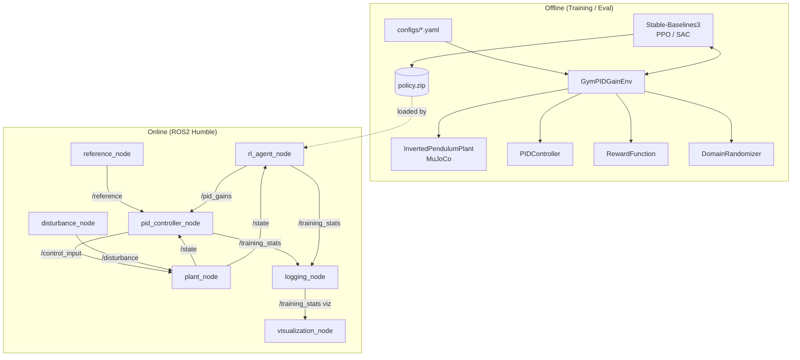
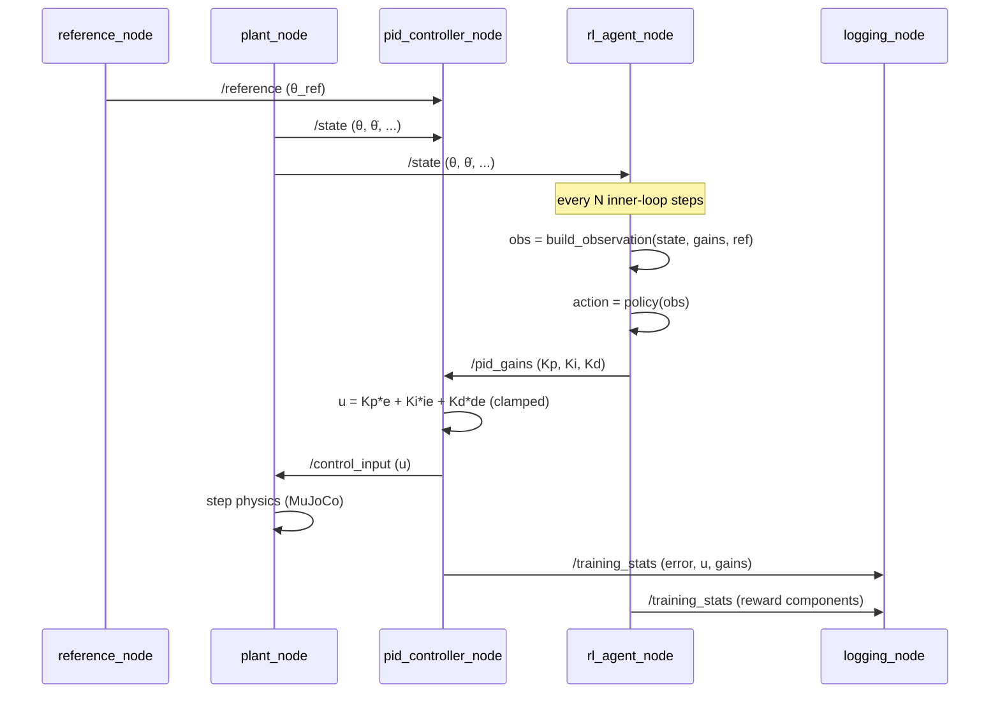

# System Architecture

## 1. Design Goals

| Goal | Design Response |
|---|---|
| Swap plants/controllers without touching RL code | Abstract `Plant`, `Controller`, `Estimator` interfaces (ABCs), injected via config, not imported directly |
| Reproducible experiments | Every run driven by a single YAML config, hashed and logged alongside results |
| Sim-to-ROS2 parity | The Gymnasium env and the ROS2 `plant_node` both wrap the *same* `InvertedPendulumPlant` class — no duplicated physics |
| Safe online adaptation | Gains are clamped and rate-limited at the actuator boundary (`GainScheduler`), independent of what the policy outputs |
| Testability | Every module has a pure-function core with no I/O side effects, so it is unit-testable without MuJoCo, ROS2, or SB3 running |

## 2. Package Layout

```
src/adaptive_pid/
├── control/         # PID core, ZN tuner, gain scheduler (no RL, no sim dependencies)
├── envs/            # Plant physics (MuJoCo), Gymnasium env, domain randomization
├── estimation/       # Disturbance / state observers
├── rewards/         # Reward function(s), fully unit-testable pure functions
└── utils/           # Config loading, typed dataclasses, structured logging
```

Dependency direction is strictly one-way:

```
utils  <—  control  <—  rewards  <—  envs  <—  training / evaluation / ros2_ws
```

`control` never imports `envs`. `rewards` never imports `envs`. This is what lets us unit test the PID and the reward function against synthetic arrays in microseconds, with no MuJoCo instantiation.

## 3. High-Level Component Diagram



## 4. ROS2 Node Responsibilities

| Node | Responsibility | Subscribes | Publishes |
|---|---|---|---|
| `plant_node` | Integrates plant dynamics (same `InvertedPendulumPlant` class used in sim) at fixed rate | `/control_input`, `/disturbance` | `/state` |
| `reference_node` | Generates the setpoint trajectory (step, sine, random walk) | — | `/reference` |
| `pid_controller_node` | Computes `u = Kp*e + Ki*∫e + Kd*ė`, applies anti-windup and output saturation | `/state`, `/reference`, `/pid_gains` | `/control_input` |
| `rl_agent_node` | Loads a trained SB3 policy, emits `[ΔKp, ΔKi, ΔKd]` at a slower outer-loop rate, integrates onto current gains | `/state` | `/pid_gains` |
| `disturbance_node` | Injects scripted or randomized disturbance torques (for HIL testing / robustness demos) | — | `/disturbance` |
| `logging_node` | Aggregates all topics into a rosbag2 + CSV for offline analysis | all above | `/training_stats` (aggregated) |
| `visualization_node` | RViz markers + live matplotlib/plotly dashboard | `/state`, `/pid_gains`, `/training_stats` | — |

## 5. Sequence Diagram — One Control Cycle



## 6. Why Delta-Gain Actions (Rationale)

Three options were considered for the action space:

1. **Absolute gains** `a = [Kp, Ki, Kd]` — simplest, but the policy must re-learn the full gain magnitude at every timestep, the action distribution is non-stationary across operating regimes, and there is no natural way to bound *how fast* gains change (a real actuator/PID implementation cares a lot about gain-change rate, since a jump in Kd directly spikes derivative kick).
2. **Absolute gains with tanh + fixed range** — bounds the output but still suffers the non-stationarity and rate problems.
3. **Delta gains** `a = [ΔKp, ΔKi, ΔKd]`, integrated: `K_t = clip(K_{t-1} + α·a, K_min, K_max)` — chosen. This bounds the rate of change directly in the action space (mirrors real actuator-rate constraints), lets us initialize `K_0` at a Ziegler–Nichols baseline so exploration starts from a stable point rather than from zero-gain instability, and keeps the action distribution stationary (the policy always outputs "how do I nudge what I currently have," not "what should the absolute value be").

This decision is enforced in code by `GainScheduler` (see `src/adaptive_pid/control/gain_scheduler.py`), which is the *only* place gain clamping happens — so the RL env, the ROS2 node, and evaluation scripts cannot each implement clamping differently.

## 7. Configuration Philosophy

All tunable parameters (plant physical params, randomization ranges, reward weights, PPO/SAC hyperparameters, gain bounds, rate limits) live in `configs/*.yaml`, loaded through `utils/config.py` into strongly-typed, validated dataclasses (not raw dicts) — so a typo in a YAML key fails fast at startup with a clear error, not silently mid-training.
